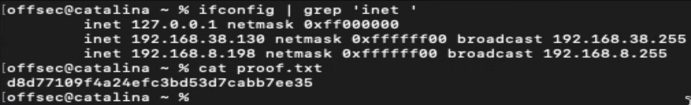

# Offsec OSMR Exam Documentation

The OffSec OSMR exam documentation contains all efforts that were conducted in order to pass the OffSec macOS Researcher exam. This report will be graded from a standpoint of correctness and fullness to all aspects of the exam. The purpose of this report is to ensure that the student has the technical knowledge required to pass the qualifications for the OffSec macOS Researcher certification.

## Objective

The objective of this exam is to solve four given assignments as described in the control panel. The student is tasked with following a methodical approach in analyzing and solving the assignments. The exam report is meant to be a writeup of the steps taken to solve the assignment, including any analysis performed and code written.

## Requirements

The student will be required to fill out this exam documentation fully and to include the following sections:

* High-Level summary of assignment solutions.
* Methodology walkthrough and detailed outline of steps taken through analysis and all written code.
* Each finding with included screenshots, walkthrough, sample code or reference.
* Screenshots of proofs.

# High-Level Summary

A brief description of the assignments that were solved, including the overall exploitation steps.

# Assignment 1

## Proof.txt

`proof.txt`: `xxxx`

## Initial Analysis

Provide relevant techniques and methods used to perform enumeration and discovery of the application and/or the environment. The steps taken should be reproducible and easy to understand. Include any custom code or references to public tools.

```{.bash caption="Initial PoC for Assignment 1"}
#!/usr/bin/env bash

...
```

## Vulnerability Discovery

Provide relevant analysis steps to locate vulnerability inside the application or environment, this includes results from static analysis and/or dynamic analysis. Explain the vulnerability identified.

Only the steps that ended up working are required.

## Exploit/Bypass Creation

Provide a description of steps to create the exploit or security control bypass. At the end of this section the full exploit (or bypass) code should be developed while an explanation of each step should be performed.

## Screenshots

The exam control panel contains a section available to submit your proof files. The contents of the local.txt, proof.txt or secret.txt files obtained from your exam machines must be submitted in the control panel before your exam has ended. Note that the control panel will not indicate whether the submitted proof is correct or not. 

Each local.txt, proof.txt or secret.txt found must be shown in a screenshot that includes the contents of the file, as well as the IP address of the target by using ipconfig.



# Assignment 2

## Proof.txt

`proof.txt`: `xxxx`

## Initial Analysis

Provide relevant techniques and methods used to perform enumeration and discovery of the application and/or the environment. The steps taken should be reproducible and easy to understand. Include any custom code or references to public tools.

```{.c caption="Initial PoC for Assignment 2"}
#include<stdio.h>

int main() {
	// ...
	return 0;
}
```

## Vulnerability Discovery

Provide relevant analysis steps to locate vulnerability inside the application or environment, this includes results from static analysis and/or dynamic analysis. Explain the vulnerability identified.

Only the steps that ended up working are required.

## Exploit/Bypass Creation

Provide a description of steps to create the exploit or security control bypass. At the end of this section the full exploit (or bypass) code should be developed while an explanation of each step should be performed.

## Screenshots

The exam control panel contains a section available to submit your proof files. The contents of the local.txt, proof.txt or secret.txt files obtained from your exam machines must be submitted in the control panel before your exam has ended. Note that the control panel will not indicate whether the submitted proof is correct or not. 

Each local.txt, proof.txt or secret.txt found must be shown in a screenshot that includes the contents of the file, as well as the IP address of the target by using ipconfig.


# Assignment 3

## Proof.txt

`proof.txt`: `xxxx`

## Initial Analysis

Provide relevant techniques and methods used to perform enumeration and discovery of the application and/or the environment. The steps taken should be reproducible and easy to understand. Include any custom code or references to public tools.

```{.objc caption="Initial PoC for Assignment 3"}
#import <Foundation/Foundation.h>

int main() {
	NSLog(@"...");
	// ...
	return 0;
}
```

## Vulnerability Discovery

Provide relevant analysis steps to locate vulnerability inside the application or environment, this includes results from static analysis and/or dynamic analysis. Explain the vulnerability identified.

Only the steps that ended up working are required.

## Exploit/Bypass Creation

Provide a description of steps to create the exploit or security control bypass. At the end of this section the full exploit (or bypass) code should be developed while an explanation of each step should be performed.

## Screenshots

The exam control panel contains a section available to submit your proof files. The contents of the local.txt, proof.txt or secret.txt files obtained from your exam machines must be submitted in the control panel before your exam has ended. Note that the control panel will not indicate whether the submitted proof is correct or not. 

Each local.txt, proof.txt or secret.txt found must be shown in a screenshot that includes the contents of the file, as well as the IP address of the target by using ipconfig.


# Assignment 4

## Proof.txt

`proof.txt`: `xxxx`

## Initial Analysis

Provide relevant techniques and methods used to perform enumeration and discovery of the application and/or the environment. The steps taken should be reproducible and easy to understand. Include any custom code or references to public tools.

```{.python caption="Initial PoC for Assignment 4"}
#include<stdio.h>

int main() {
	// ...
	return 0;
}
```

## Vulnerability Discovery

Provide relevant analysis steps to locate vulnerability inside the application or environment, this includes results from static analysis and/or dynamic analysis. Explain the vulnerability identified.

Only the steps that ended up working are required.

## Exploit/Bypass Creation

Provide a description of steps to create the exploit or security control bypass. At the end of this section the full exploit (or bypass) code should be developed while an explanation of each step should be performed.

## Screenshots

The exam control panel contains a section available to submit your proof files. The contents of the local.txt, proof.txt or secret.txt files obtained from your exam machines must be submitted in the control panel before your exam has ended. Note that the control panel will not indicate whether the submitted proof is correct or not. 

Each local.txt, proof.txt or secret.txt found must be shown in a screenshot that includes the contents of the file, as well as the IP address of the target by using ipconfig.


# Appendix I: Assignment Files

The following is a table of all assignment files that are attached with this report. 

: Attached assignment files

+--------+------------------------------------------------+
|**Task**|**Assignment file**                             |
+:======:+:==============================================:+
|**1**   | assignment1.sh                                 |
+--------+------------------------------------------------+
|**2**   | assignment2.c                                  |
+--------+------------------------------------------------+
|**3**   | assignment3.m                                  |
+--------+------------------------------------------------+
|**4**   | assignment4.c                                  |
+--------+------------------------------------------------+

# Appendix II: proof.txt files

: Proofs summary

+------+--------------+----------------------------------------------------+
|**ID**| **IP**       |                      **Proofs**                    |
+:====:+:============:+:==================================================:+
|**1** |   x.x.x.x    | **proof.txt** : xxxxxxxxxxxxxxxxxxxxxxxxxxx        |
+------+--------------+----------------------------------------------------+
|**2** |   x.x.x.x    | **proof.txt** : xxxxxxxxxxxxxxxxxxxxxxxxxxx        |
+------+--------------+----------------------------------------------------+
|**3** |   x.x.x.x    | **proof.txt** : xxxxxxxxxxxxxxxxxxxxxxxxxxx        |
+------+--------------+----------------------------------------------------+
|**4** |   x.x.x.x    | **proof.txt** : xxxxxxxxxxxxxxxxxxxxxxxxxxx        |
+------+--------------+----------------------------------------------------+
